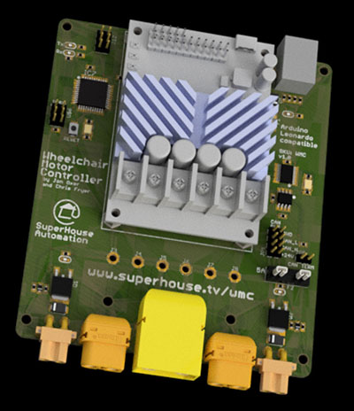

Wheelchair Motor Controller
===========================

Motion controller for an electric wheelchair using 24V DC motors, such
as a Permobil F5.

Controls two wheelchair motors using a RoboClaw motor driver. It also
has outputs for a solenoid braking system, and a CAN bus interface to
communicate with other modules on the chair.

Features:

 * Takes power from the chair battery.
 * Mounting location for RoboClaw motor driver.
 * Communicates with RoboClaw using serial commands.
 * MOSFETs to release mechanical brakes.
 * CAN bus.

More information is available at:

  https://www.superhouse.tv/wmc

Hardware
--------
The "Hardware" directory contains the PCB design as an EAGLE project.
EAGLE PCB design software is available from Autodesk free for
non-commercial use.

Firmware
--------
The "Firmware" directory contains example firmware as an Arduino
project.

Credits
-------
Jonathan Oxer <jon@oxer.com.au>
Chris Fryer <chris.fryer78@gmail.com>

License
-------
Copyright 2019-2020 SuperHouse Automation Pty Ltd  www.superhouse.tv  

The hardware portion of this project is licensed under the TAPR Open
Hardware License (www.tapr.org/OHL). The "license" folder within this
repository contains a copy of this license in plain text format.

The software portion of this project is licensed under the Simplified
BSD License. The "licence" folder within this project contains a
copy of this license in plain text format.

